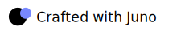

# Welcome to Juno Brand & Marketing page

Follow these guidelines when promoting [Juno] in marketing communications, including advertising, articles, websites, and printed promotions.

## Table of contents

- [Logo](#logo)
- [Colors](#colors)
- [Slogans](#slogans)
- [Fonts](#fonts)
- [Press inquiries](#press-inquiries)
- [Goodies](#goodies)

## Logo

The [Juno] logo can be displayed with either a textual representation or a simplified icon, with each option available in two color variants. Pick the one that fits your material the best.

> [!IMPORTANT]
> Please choose the one that best suits your material—the one that makes your designer say: "Yeah, that looks great!"

### Textual

### Icon

## Colors

[Juno] uses lavender-blue as its primary color, and various alternative secondary colors can also be used.

| Color          | Value       |                                       |
|----------------|-------------|---------------------------------------|
| lavender-blue  | `#7888ff`   | Common colors used for communication. |
| papaya-whip    | `#ffcf98`   |                                       |
| aero-blue      | `#97ffd2`   |                                       |
| pink-lace      | `#ff97e7`   |                                       |
| baby-pink      | `#ff8989`   |                                       |
| shandy         | `#ffe36f`   |                                       |
| hot-pink       | `#f374ae`   |                                       |
| folly-lighter  | `#ff6687`   |                                       |
| keppel         | `#2ebfa5`   |                                       |
| tiffany-blue   | `#75dddd`   |                                       |

## Slogans

If you've built a project using [Juno], you're welcome to display these slogans on your pages as a token of your appreciation. We appreciate your support! 🙏

- **Built on Juno**
- **Crafted with Juno**

And if you're looking to promote building to encourage other developers adopt Juno, you can use this slogan:

- **Build with Juno**

### Badges

Above slogans are designed to work best when used in conjunction with the [icon](#icon).

If you would like to use a pre-made badge, you can select one from the following options.

#### Built on Juno

#### Crafted with Juno

#### Build with Juno

## Fonts

[Juno] uses the free and open source typeface font [Jetbrains Mono](https://www.jetbrains.com/lp/mono/).

## Press inquiries

Please direct inquiries to [david@fluster.io](mailto:david@fluster.io)

[juno]: https://juno.build